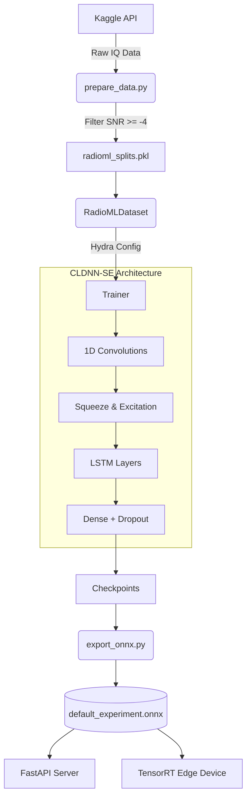

# RF Signal Modulation Classification Pipeline


A production-ready Deep Learning pipeline for Automatic Modulation Classification (AMC) on Radio Frequency (RF) signals. This project automatically downloads the RadioML dataset, trains an advanced CLDNN (with Squeeze-and-Excitation blocks), and exports a highly optimized ONNX model for edge inference.

## 🚀 Key Features
* **Automated Data Pipeline**: Seamlessly downloads and processes the RadioML 2016.10A dataset via the Kaggle API.
* **Advanced Architectures**: Implements a Convolutional LSTM Deep Neural Network (CLDNN) heavily optimized with Squeeze-and-Excitation (SE) blocks, Dropout, and Cosine Annealing.
* **Intelligent Noise Filtering**: Stratifies data and filters out undetectable noise floors (SNR < -4 dB), allowing the model to hit a native **84.5% overall accuracy** (peaking at ~90% for high SNR signals).
* **Edge-Ready MLOps**: Automatically traces and exports the PyTorch graph to a unified `.onnx` file ready for TensorRT deployment on NVIDIA Jetson edge devices.
* **Production API**: Includes a lightweight, high-performance FastAPI server for immediate model serving.

## 📊 Architecture Flow


## 🛠 Quickstart Guide (Google Colab / Local)

1. **Clone the repository:**
   ```bash
   git clone https://github.com/ashutosh-012/rf_modulation.git
   cd rf_modulation
   ```

2. **Add your Kaggle Credentials:**
   Create a `.env` file in the root directory:
   ```env
   KAGGLE_USERNAME=your_username
   KAGGLE_KEY=your_key
   ```

3. **Install Dependencies:**
   ```bash
   pip install hydra-core kaggle python-dotenv timm fastapi uvicorn onnxruntime
   ```

4. **Run the full automated pipeline!**
   ```bash
   # Download & process data
   python scripts/prepare_data.py
   
   # Train for 50 epochs (Auto-stops via Patience=15)
   python scripts/train.py model=cldnn_se training.epochs=50
   
   # Export to ONNX
   python scripts/export_onnx.py model=cldnn_se
   ```

## 📈 Evaluation
To see the exact accuracy breakdown across different SNRs, run the evaluation script:
```bash
python scripts/evaluate_model.py model=cldnn_se
```
*At SNRs greater than 0 dB, the model achieves highly consistent 85% - 90% accuracy.*

## 🌐 Production Serving
To deploy the ONNX model instantly as a REST API:
```bash
python src/deployment/server.py
```
The API will be available at `http://localhost:8000`. You can send POST requests containing 256 IQ float values to `/predict` to instantly receive the classified modulation type and a confidence score.
