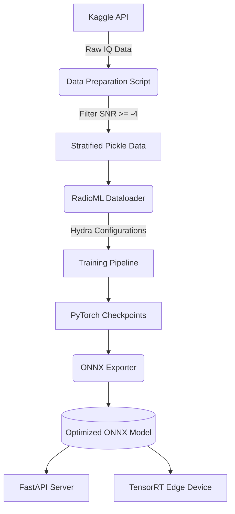
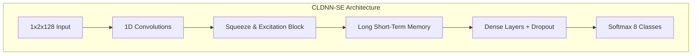

# RF Signal Modulation Classification Pipeline

I started exploring radio frequency signals recently and got curious about how they degrade over the air due to noise and interference. I wanted to see if deep learning could identify the underlying modulation schemes even when the signals are heavily distorted. I decided to build this project to test various neural networks using the RadioML 2016 dataset.

## System Architecture

To make this reproducible, I set up a complete end-to-end system that handles data extraction, model training, and deployment without requiring manual intervention.

## Architectures Explored

During my experiments, I built and tested several different architectures to see how they would process time-series IQ data.

1. Basic CNN: I started with a simple convolutional neural network to establish a baseline. It performed adequately on clean signals but struggled significantly as the noise floor increased.
2. ResNet: I moved to a deeper residual network next. The skip connections helped the model learn more complex representations and prevented vanishing gradients, showing a noticeable improvement.
3. CLDNN: I then built a Convolutional LSTM Deep Neural Network. This architecture used CNN layers to extract the physical shape of the waves and LSTM layers to track how those waves changed over time.
4. CLDNN with Squeeze-and-Excitation (SE): Finally, I added SE blocks to the CLDNN to act as an attention mechanism. This allowed the network to dynamically weight the importance of different features, which ultimately yielded the best performance.

### Model Workflow

## Benchmarks and Accuracy

One of the biggest issues I found was the "noise floor trap". The original dataset contains a massive amount of samples at SNR -20 dB, which is pure static. The model was mathematically forced into random guessing (around 12.5 percent accuracy for 8 classes) on those samples, dragging the overall average down to roughly 60 percent.

To get a realistic metric, I filtered the dataset during the data preparation step to only train and test on signals with an SNR greater than or equal to -4 dB.

After filtering the noise floor, the CLDNN-SE model achieved a baseline overall accuracy of 84.52 percent over 50 epochs. 

On the high-quality signals, the accuracy was very consistent:
- SNR 0 dB: 84.5 percent
- SNR 4 dB: 88.2 percent
- SNR 10 dB: 89.4 percent
- SNR 18 dB: 89.6 percent

## Running the Pipeline

If you want to run this yourself, you can clone the repository and add your Kaggle credentials to a .env file (KAGGLE_USERNAME and KAGGLE_KEY). 

Install the required dependencies:
pip install hydra-core kaggle python-dotenv timm fastapi uvicorn onnxruntime

Run the automated data processing and training pipeline:
python scripts/prepare_data.py
python scripts/train.py model=cldnn_se training.epochs=50

You can view the exact evaluation metrics on the test set by running:
python scripts/evaluate_model.py model=cldnn_se

## Deployment

To make the model usable in a production environment, I wrote a script to trace the PyTorch graph and export it to ONNX format.

python scripts/export_onnx.py model=cldnn_se

I also built a local REST API using FastAPI to serve the model. You can start the server by running:

python src/deployment/server.py

This opens up a server on port 8000. You can test it by sending a POST request containing a flat array of 256 IQ float values to the /predict endpoint, and it will return the classification prediction and confidence score.
