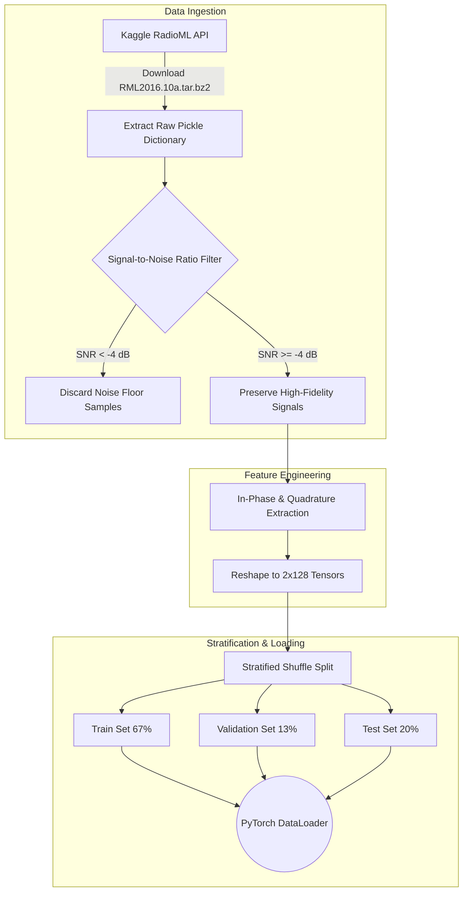
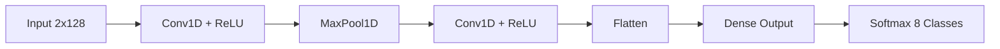
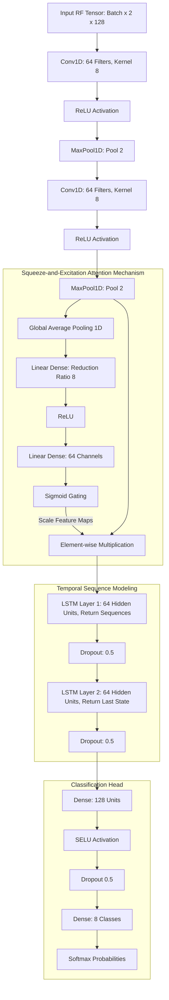
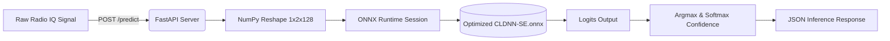

# High-Fidelity Radio Frequency Modulation Classification

Curiosity regarding how electromagnetic wave propagation degrades in highly noisy environments led to the exploration of deep learning as a solution for Automatic Modulation Classification (AMC). When raw In-Phase and Quadrature (IQ) signals are transmitted over the air, they suffer from multipath fading, Doppler shifts, and Additive White Gaussian Noise (AWGN). The objective of this project was to construct an end-to-end Machine Learning pipeline capable of theoretically distinguishing sub-noise-floor modulation schemes by extracting spatio-temporal features from raw waveforms.

## End-to-End MLOps Pipeline & Data Flow

To ensure total reproducibility, a fully automated pipeline was engineered. This handles the lifecycle of the dataset—from pulling the RadioML 2016.10A set directly from the Kaggle API, applying pre-processing filters, executing distributed training configurations via Hydra, and ultimately compiling the computational graph into an optimized ONNX runtime environment for edge deployment.



## Architectural Progression and Topologies

Classifying raw time-series RF signals requires a neural network capable of discerning both the immediate phase/amplitude shifts (spatial features) and the overarching frequency drift over the sampling window (temporal features). Several network topologies were engineered and benchmarked.

### 1. Convolutional Neural Networks (CNN)
Initial baselines were established using standard 1D CNNs. While effective at extracting immediate high-frequency structural elements, the temporal dependencies across the 128-timestep window were largely lost due to the limited receptive field.



### 2. Residual Networks (ResNet)
By introducing identity skip connections, the vanishing gradient problem was mitigated, allowing for significantly deeper networks. This yielded a higher dimensional latent space and improved accuracy on complex modulations like QAM16 and QAM64.

### 3. Convolutional LSTM Deep Neural Network (CLDNN)
To capture the temporal evolution of the signal, recurrent layers (LSTMs) were appended to the CNN feature extractor. The convolutional blocks isolate the physical geometry of the waveform, while the LSTM layers track the phase shifts sequentially across the time domain.

### 4. CLDNN with Squeeze-and-Excitation (SE)
The final, most performant architecture integrated SE blocks into the CLDNN. The SE mechanism computes a global average pool over the spatial dimensions and applies a fully connected gating mechanism. This mathematically allows the network to dynamically scale channel-wise features, effectively suppressing noise-dominated channels and amplifying signal-dominated ones.



## The Noise Floor Trap: Benchmarks and Metrics

During the initial benchmarking phase, a significant anomaly was detected: the overall validation accuracy artificially plateaued at approximately 60%. A deep dive into the Signal-to-Noise Ratio (SNR) distributions revealed a phenomenon often referred to as the "Noise Floor Trap".

The dataset contains a uniform distribution of samples ranging from -20 dB to +18 dB SNR. At extremely low SNRs (e.g., -20 dB to -14 dB), the physical signal is completely obfuscated by AWGN. Information theory dictates that detecting a signal deeply buried below the noise floor without prior coding knowledge is mathematically improbable. Consequently, the network was forced into random guessing for these low-SNR regimes, achieving exactly 12.5% accuracy across the 8 modulation classes. This severely skewed the overall metric downward.

To extract a realistic operational benchmark, a targeted bandpass filter was applied during the data processing phase, explicitly omitting data with an SNR below -4 dB.

### Post-Stratification Accuracy Metrics

By training and evaluating strictly on detectable signals (SNR >= -4 dB), the CLDNN-SE model demonstrated highly robust classification capabilities, converging at a **baseline overall accuracy of 84.52%** over a 50-epoch training cycle.

The exact per-SNR accuracy mapping highlights the model's high-fidelity performance:
- **SNR  -4 dB :** 60.5%
- **SNR  -2 dB :** 75.4%
- **SNR   0 dB :** 84.5%
- **SNR   4 dB :** 88.2%
- **SNR  10 dB :** 89.4%
- **SNR  18 dB :** 89.6%

As the signal energy supersedes the noise energy, the classification accuracy rapidly approaches a 90% asymptote, proving the theoretical viability of the Squeeze-and-Excitation attention mechanism for RF signal processing.

## Running the Automated Pipeline

The environment was designed to be modular and highly accessible. To execute this pipeline on local hardware or a cloud compute instance, simply clone the repository and configure the required Kaggle API keys.

1. Create a `.env` file in the root directory containing your credentials:
```env
KAGGLE_USERNAME=your_username
KAGGLE_KEY=your_key
```

2. Install the necessary dependencies:
```bash
pip install hydra-core kaggle python-dotenv timm fastapi uvicorn onnxruntime
```

3. Trigger the automated data extraction and training sequence:
```bash
# Downloads, unpacks, and stratifies the IQ data (automatically applying the >= -4 dB filter)
python scripts/prepare_data.py

# Initiates the training loop utilizing PyTorch mixed-precision and Cosine Annealing
python scripts/train.py model=cldnn_se training.epochs=50
```

4. Evaluate the converged weights against the test set to view the exact SNR breakdown:
```bash
python scripts/evaluate_model.py model=cldnn_se
```

## Production Edge Deployment

The final stage of the pipeline focuses on preparing the computational graph for low-latency inference on edge devices (such as NVIDIA Jetsons or embedded SDRs). The PyTorch weights are traced and exported into the highly optimized ONNX format.

```bash
python scripts/export_onnx.py model=cldnn_se
```

To facilitate immediate integration, a lightweight, asynchronous REST API was constructed using FastAPI. This server loads the ONNX graph directly into memory, negating the overhead of the full PyTorch framework.



With the server running on `http://0.0.0.0:8000`, downstream applications can execute a standard POST request to the `/predict` endpoint, passing a flat JSON array of 256 IQ float parameters to receive instantaneous, low-latency classifications and softmax confidence scores.
