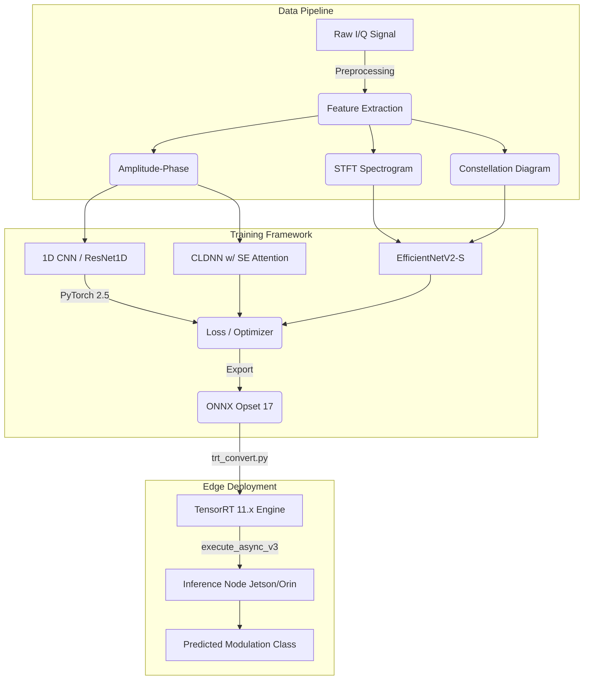
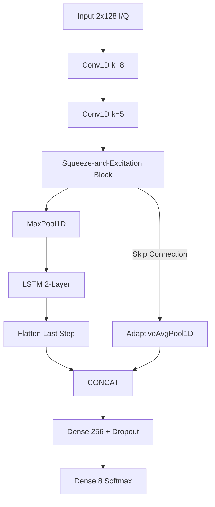

# System Architecture & Flow

This document details the architectural decisions and deployment pipeline for the AMC (Automatic Modulation Classification) Edge System.

## High-Level System Architecture

## Model Architectures

### CLDNN with Squeeze-and-Excitation (SE)
This is our primary 1D architecture optimized for edge execution.

## SNR Stratification Strategy
To prevent data leakage, samples are grouped by their `(Modulation, SNR)` tuple before random assignment to Train/Val/Test splits. This guarantees the model sees varying noise floors consistently without inadvertently testing on adjacent time-windows from the training set.
